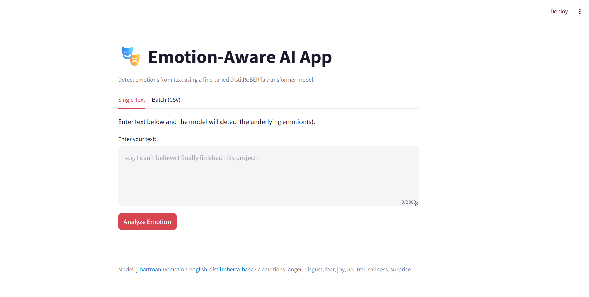
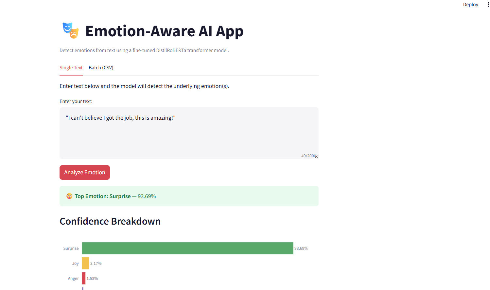
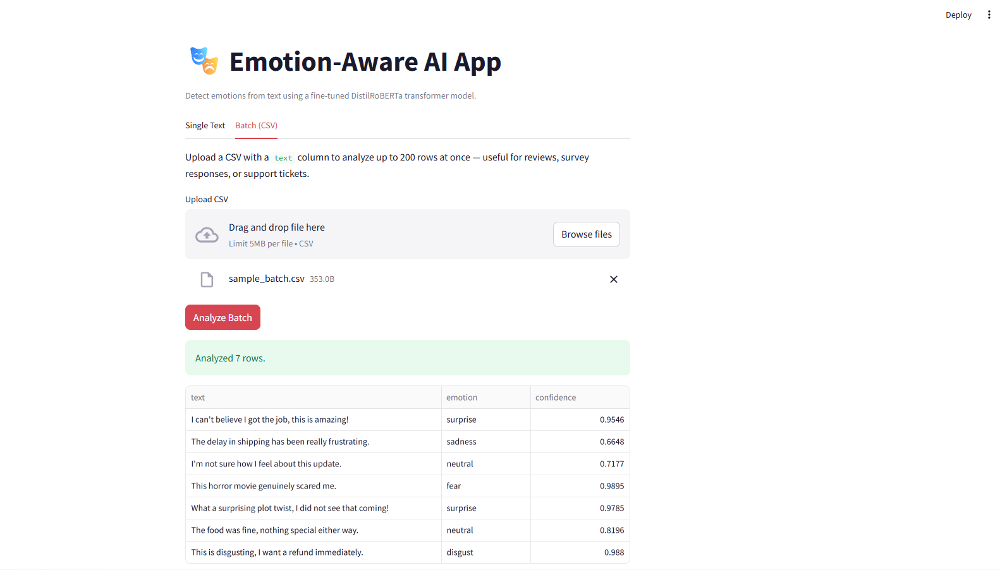

# 🎭 Emotion AI App

A production-structured Streamlit app that detects emotions in text using a fine-tuned transformer model - with single-text analysis, batch CSV processing, confidence visualizations, and full test coverage.


## Preview








## Overview

This app classifies free-text input into one of seven emotions - **joy, sadness, anger, fear, surprise, disgust, neutral** - using [`j-hartmann/emotion-english-distilroberta-base`](https://huggingface.co/j-hartmann/emotion-english-distilroberta-base), a DistilRoBERTa model fine-tuned for emotion classification.

It started as a single 40-line script and was refactored into a layered architecture with proper error handling, input validation, unit tests, and batch processing - the kind of structure a real product team would expect in a code review.

## Features

- **Single-text analysis** - type any sentence and get the top emotion plus a full confidence breakdown as an interactive bar chart
- **Batch analysis via CSV upload** - analyze up to 200 rows at once (reviews, survey responses, support tickets) and download results as CSV
- **Low-confidence flagging** - warns the user when the model isn't confident, instead of presenting an uncertain guess as fact
- **Session history** - tracks everything analyzed in the current session
- **Graceful error handling** — model load failures, oversized input, and malformed CSVs are caught and shown as clear messages, not stack traces
- **24 unit tests** covering validation, formatting, and the inference engine (with a mocked model — no GPU or download needed to run tests)

## Architecture

The app is split into focused layers instead of one monolithic script:

```
emotion-ai-app/
├── app.py                  # Streamlit UI only — layout, input, rendering
├── core/
│   ├── config.py            # Model settings, thresholds, emotion→color/emoji maps
│   ├── engine.py             # EmotionEngine: model loading + inference, typed exceptions
│   ├── utils.py               # Pure functions: validation, formatting (fully unit-testable)
│   └── visualization.py        # Plotly chart builder, decoupled from UI flow
├── tests/
│   ├── test_engine.py        # Engine tests with a mocked transformers pipeline
│   └── test_utils.py          # Validation & formatting tests
├── .github/workflows/ci.yml  # Lint + test on every push
├── Dockerfile                 # Model pre-downloaded at build time
└── requirements.txt
```

**Why this structure?** Splitting into layers keeps each piece testable and easy to reason about independently:
- `core/engine.py` never imports `streamlit`, so it can be tested with a mocked model in milliseconds
- `core/utils.py` has zero dependencies on Streamlit or transformers — pure functions in, pure values out
- `app.py` has no `try/except` around raw exceptions — it only ever catches the typed `ValidationError` / `InferenceError` / `ModelLoadError` that the lower layers raise

## Design decisions

- **Input validation is enforced before inference** — empty or oversized text never reaches the model; the user gets a clear message instead of a crash or a hang.
- **Typed exceptions instead of raw tracebacks** — model load failures and inference errors are caught and shown as readable messages.
- **Confidence shown as a sorted bar chart**, not a list of raw scores — makes it easy to see at a glance which emotions the model considered plausible, and by how much.
- **Low-confidence flagging** — warns the user when the top prediction isn't confident, instead of presenting an uncertain guess as fact.
- **Batch mode for real-world use** — a single text box is a demo; a CSV upload with downloadable results is closer to how this would actually be used (triaging reviews or support tickets).

## Getting Started

### Prerequisites
- Python 3.11+
- ~500MB disk space (model weights, downloaded on first run)

### Installation

```bash
git clone https://github.com/Gayathri-Reddy874/emotion-ai-app.git
cd emotion-ai-app
python -m venv venv
source venv/bin/activate   # Windows: venv\Scripts\activate
pip install -r requirements.txt
```

### Run locally

```bash
streamlit run app.py
```

The app opens at `http://localhost:8501`. The model downloads automatically on first run (~300MB) and is cached afterward.

### Run with Docker

```bash
docker build -t emotion-ai-app .
docker run -p 8501:8501 emotion-ai-app
```

The model is pre-downloaded at build time, so the container works even without internet access at runtime.

### Run tests

```bash
pip install -r requirements-dev.txt
pytest tests/ -v --cov=core
```

Tests mock the `transformers` pipeline directly, so the full suite runs in under a second with no model download required.

## Batch CSV format

Upload a CSV with a `text` column:

```csv
text
"I can't believe I got the job, this is amazing!"
"The delay in shipping has been really frustrating."
"I'm not sure how I feel about this update."
```

Results (top emotion + confidence per row) can be downloaded as CSV directly from the app.

## Tech Stack

| Layer | Choice |
|---|---|
| UI | Streamlit |
| Model | Hugging Face Transformers (`j-hartmann/emotion-english-distilroberta-base`) |
| Charting | Plotly |
| Data handling | Pandas |
| Testing | pytest, unittest.mock |
| Linting | Ruff |
| CI | GitHub Actions |
| Deployment | Docker |

## Roadmap

- [ ] Multi-language emotion detection
- [ ] Sentence-level breakdown for multi-sentence input
- [ ] Streamlit Community Cloud deployment badge + live demo link

## License

MIT — see [LICENSE](LICENSE).
